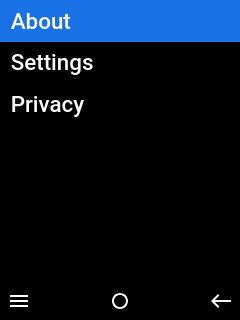
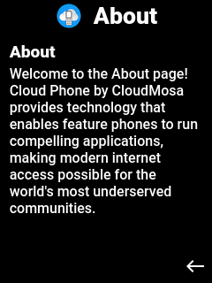
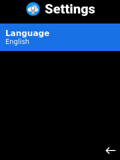
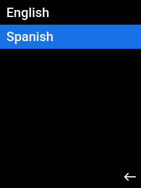

# [Cloud Phone](https://www.cloudfone.com/) - Vue Sample Widget

:beginner: This is a beginner guide on [Cloud Phone](https://www.cloudfone.com/) widget development, created using [`create-vue`](https://github.com/vuejs/create-vue) to bootstrap a [Vue.js](https://vuejs.org/) project.

[https://cloudmosa.github.io/cloudphone-vue-sample/](https://cloudmosa.github.io/cloudphone-vue-sample/)

  
&nbsp; &nbsp; &nbsp; &nbsp;
  
&nbsp; &nbsp; &nbsp; &nbsp;
  

  
&nbsp; &nbsp; &nbsp; &nbsp;
  
&nbsp; &nbsp; &nbsp; &nbsp;
  

## Prerequisites

- [Node & npm](https://nodejs.org/en/download/)
- [Git](https://git-scm.com/book/en/v2/Getting-Started-Installing-Git)
- A [GitHub](https://github.com/signup) account :octocat:

## Pages

### `HomeView.vue`

The default page that uses an OptionsMenu for navigating to About, Settings, or Privacy (external).

### `AboutView.vue`

A simple page displaying a static description.

### `SettingsView.vue`

A page for configuring the application. By default, the application will detect the best candidate from the browser's language. Users can override this on the settings page.

## Components

### `AppHeader.vue`

A header displayed at the top of the screen. Includes a fixed logo and a `title` property that updates both `document.title` and an `h1` tag displaying the title on screen.

### `OptionsMenu.vue`

A modal containing a list of menu items. Supports T9 keyboard navigation. Focus is moved using `ArrowUp` and `ArrowDown`. Menu items are selected using `Enter`.

### `SoftKeyBar.vue`

An on-screen menu bar with three actions in the positions `start` (left), `center`, and `end` (right). Supports both icon and text actions triggered via a global `keydown` event listener.

On Cloud Phone, soft keys are mapped as follows:

| Name                 | Key      | Function         |
| -------------------- | -------- | ---------------- |
| Left Soft Key (LSK)  | `Escape` | Programmable     |
| Right Soft Key (RSK) | N/A      | `history.back()` |
| Enter                | `Enter`  | Programmable     |

Because developers cannot override the RSK behavior, clicking RSK also calls `history.back()` to reproduce the same behavior on desktop browsers.

## Deploy to GitHub Pages

[GitHub Pages](https://pages.github.com/) offers free hosting for public open-source repositories. This project uses the official [deploy-pages](https://github.com/actions/deploy-pages) GitHub Action to build and deploy static HTML, CSS, and JS. Set the [`base` path configuration](https://v2.vitejs.dev/config/#base) in `vite.config.js` to match your repository name and ensure the `path` provided to the `upload-pages-artifact` GitHub Action matches the default `dist/` directory.

:warning: <u>Production</u>: although it's possible to configure [custom domain names](https://docs.github.com/en/pages/configuring-a-custom-domain-for-your-github-pages-site/about-custom-domains-and-github-pages), "GitHub Pages is not intended for or allowed to be used... either facilitating commercial transactions or providing commercial software" ([see Prohibited Uses](https://docs.github.com/en/pages/getting-started-with-github-pages/about-github-pages#prohibited-uses)). Use GitHub Pages for production applications at your own risk.

## Developer Program

Register for the [Cloud Phone Developer Program](https://www.cloudfone.com/developer-program) to upload test widgets and use the Cloud Phone Simulator.

## License

Licensed under the [Apache 2.0](./LICENSE) license
